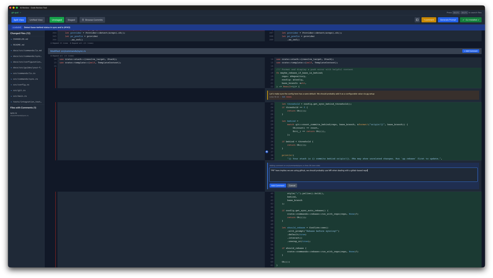

# AI Review

AI Review (`air`) is a desktop code review tool for reviewing diffs, adding inline comments, and generating structured prompts to send back to AI coding agents.

It brings a pull-request-style review experience to the human → AI feedback loop.



## Features

- **CLI launcher (`air`)** — open AI Review from any Git repository
- **Git integration** — auto-detect repositories and load unstaged, staged, or commit diffs
- **Changed files sidebar** — file list with status badges (M/A/D/R)
- **Split and Unified diff views** with syntax highlighting
- **Inline comments on lines** — click the gutter or press `C`
- **Comment editing and deletion**
- **Fuzzy file search** — press `Shift` + `Shift`
- **Prompt generation from comments** — structured output with code snippets
- **Expandable hunk context**
- **Multi-repo management**
- **Commit selector**

## Agent Skill

AI Review ships with a **human-review** skill that AI coding agents can use to request your review before committing or merging. The agent runs `air --wait`, which opens the diff viewer and blocks until you submit your feedback. The agent then addresses each comment automatically.

The skill definition lives in [`skills/human-review/SKILL.md`](skills/human-review/SKILL.md) and works with any agent framework that supports skill files (OpenClaw, Claude Code, Codex CLI, etc.).

## Tech Stack

- **Desktop shell:** Tauri v2 (Rust backend)
- **Frontend:** React + TypeScript + Vite
- **Styling:** Tailwind CSS

## Prerequisites

- Node.js v20+
- pnpm
- Rust toolchain

## Installation

### Homebrew (macOS, Apple Silicon)

```bash
brew install --cask mrmans0n/tap/ai-review
```

This installs the app and the `air` CLI command.

### Manual

Download the latest release from [GitHub Releases](https://github.com/mrmans0n/ai-review/releases):

- **macOS** — `.dmg` (Apple Silicon)
- **Linux** — `.AppImage` or `.deb`

### From Source

```bash
pnpm install
pnpm tauri build
cd cli && ./install.sh
# then: air (from any git repo)
```

## Development

- `pnpm dev` — run the web app only
- `pnpm tauri dev` — run the desktop app with hot reload

## Keyboard Shortcuts

- `Shift` + `Shift` — file search
- `C` — add comment
- `Cmd/Ctrl + Enter` — submit comment
- `Esc` — close modals

## Project Structure

```text
.
├── src/
│   ├── components/   # UI components (diffs, sidebar, comments, modals)
│   ├── hooks/        # React hooks for UI and state behavior
│   └── lib/          # Core client logic (git, prompt building, utilities)
├── src-tauri/
│   └── src/          # Rust backend commands and app integration
└── cli/              # air launcher installer and CLI wiring
```

## License

MIT — see [LICENSE](./LICENSE).
