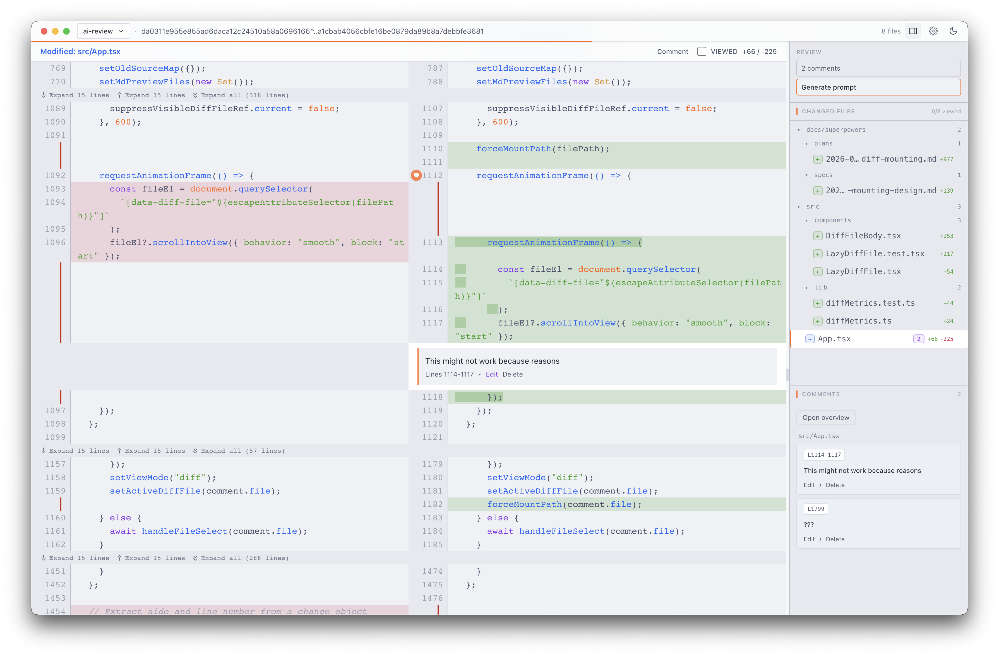
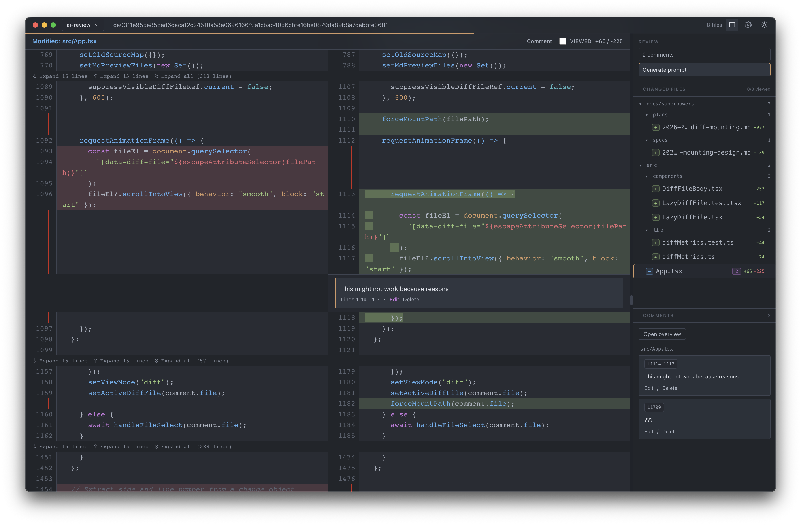

# AI Review

AI Review (`air`) is a desktop code review tool for reviewing diffs, adding inline comments, and generating structured prompts to send back to AI coding agents.

It brings a pull-request-style review experience to the human → AI feedback loop.

| Light | Dark |
|-------|-------------|
|  |  |

## Features

- **CLI launcher (`air`)** — open AI Review from any Git repository
- **Git integration** — auto-detect repositories and load unstaged, staged, or commit diffs
- **Changed files sidebar** — file list with status badges (M/A/D/R)
- **Split and Unified diff views** with syntax highlighting
- **Inline comments on lines** — click the gutter or press `C`
- **Comment editing and deletion**
- **Fuzzy file search** — press `Ctrl/⌘ + O`
- **Prompt generation from comments** — structured output with code snippets
- **Expandable hunk context**
- **Multi-repo management**
- **Commit selector**

## Agent Skills

AI Review ships with skills that AI coding agents can use to interact with the desktop app. The most important one is **human-review**, which lets the agent request your code review before committing — it runs `air --wait`, opens the diff viewer, blocks until you submit feedback, and the agent addresses each comment automatically.

| Skill | Description |
|-------|-------------|
| [**human-review**](skills/human-review/SKILL.md) | Request human code review with inline comments and feedback loop |
| [**show-changes**](skills/show-changes/SKILL.md) | Present completed work for optional review |
| [**review-commits**](skills/review-commits/SKILL.md) | Open existing commits or branch diffs for review |
| [**browse-diff**](skills/browse-diff/SKILL.md) | Open the diff viewer just for browsing (no feedback loop) |

### Claude Code

Install as a [Claude Code plugin](https://docs.anthropic.com/en/docs/agents/claude-code/plugins) to give your agent access to all skills automatically:

```bash
claude plugin marketplace add https://github.com/mrmans0n/ai-review
claude plugin install ai-review
```

That's it — Claude Code will discover the skills and can invoke `air` during coding sessions.

### Other Agents (OpenClaw, Codex CLI, etc.)

Use the [Skills](https://github.com/vercel-labs/skills) tool to install:

```bash
npx skills add mrmans0n/ai-review
```

## Tech Stack

- **Desktop shell:** Electron (Rust sidecar backend)
- **Frontend:** React + TypeScript + Vite
- **Styling:** Tailwind CSS

## Prerequisites

- Node.js v20+
- pnpm
- Rust toolchain

## Installation

### Homebrew (macOS, Apple Silicon)

```bash
brew install --cask mrmans0n/tap/ai-review
```

This installs the app and the `air` CLI command.

### Manual

Download the latest release from [GitHub Releases](https://github.com/mrmans0n/ai-review/releases):

- **macOS** — `.dmg` (Apple Silicon)
- **Linux** — `.AppImage` or `.deb`

> **macOS note:** The app is not code-signed with an Apple Developer certificate. When opening for the first time, macOS Gatekeeper may show an error saying the app is "damaged" or "can't be opened." To fix this, run:
>
> ```bash
> xattr -cr /Applications/AI\ Review.app
> ```
>
> If you installed via Homebrew, this is handled automatically.

### From Source

```bash
pnpm install
pnpm electron:build
cd cli && ./install.sh
# then: air (from any git repo)
```

## Development

- `pnpm dev` — run the web app only
- `pnpm electron:dev` — run the desktop app with hot reload

## Keyboard Shortcuts

- `Ctrl/⌘ + O` — file search
- `C` — add comment
- `Cmd/Ctrl + Enter` — submit comment
- `Esc` — close modals

## Project Structure

```text
.
├── src/
│   ├── components/   # UI components (diffs, sidebar, comments, modals)
│   ├── hooks/        # React hooks for UI and state behavior
│   └── lib/          # Core client logic (git, prompt building, utilities)
├── electron/         # Electron main + preload (TypeScript)
├── core/             # Rust workspace (core-lib, core-sidecar, core-launcher)
└── cli/              # air launcher installer and CLI wiring
```

## License

MIT — see [LICENSE](./LICENSE).
